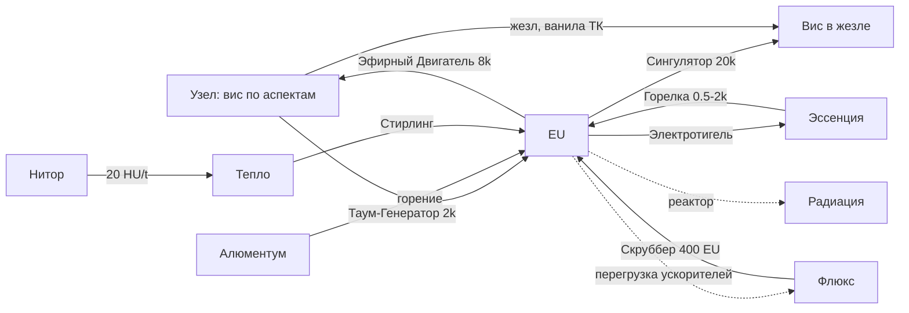

# 02 · Модель мира: силы, законы, курсы, глоссарий

Этот файл отвечает на вопрос «что вообще есть в мире и как оно связано».
Все курсы обмена в моде живут **только здесь** (§3). Любой другой документ
или класс обязан ссылаться на эту таблицу, а не повторять числа.

---

## 1. Шесть сил мира

| Сила | Чья | Где хранится | Характер | Кто её тратит |
|---|---|---|---|---|
| **Вис (в узле)** | ТК | Узлы (`INode`), по-аспектно | Живой, восстанавливается сам, конечен на точке | Жезлы, наши конвертеры |
| **Вис (в жезле)** | ТК | NBT жезла, по-аспектно | Личная валюта игрока, ~150 ед. — потолок | Все каст-механики ТК |
| **Эссенция** | ТК | Фиалы, трубы, тигель | Аспект как жидкость; автоматизируемо | Алхимия, наши ускорители |
| **EU** | IC2 | Буферы машин, кабели | Дискретен, транспортируем, дёшев | Все машины IC2 |
| **Тепло (HU)** | IC2 | Не хранится, только поток | Побочный слой; конвертируется в EU через Стирлинг | Теплопотребители IC2 |
| **Отходы** | обе | Мир | Флюкс (магия) и радиация (техника) — цена работы | Портят игрока и местность |

### 1.1. Критичное уточнение: «аура» = узлы

В TC4-порте **нет ауры чанков**. Классы `AuraHelper`/`AuraChunk`/
`AuraHandler` — мёртвый TC6-совместимый фасад: ничего не читает, не пишет,
не сохраняется. Поэтому:

> Везде, где в архивных доках (v1–v5) написано «аура чанка», следует читать
> **«узлы»**. Эфирный Двигатель заряжает узлы. Перегрузка ускорителей
> выбрасывает флюкс-блоки в мир, а не «флюкс в ауру».

### 1.2. Правило работы с эссенцией

Эссенция в TC4 — **не жидкость**: у неё своя система тяги
(`IEssentiaTransport`), несовместимая ни с `FluidStack`, ни с рецептами
машин IC2. Отсюда жёсткое правило:

> Любая машина, которая касается эссенции, — **наш блок**, реализующий
> `IEssentiaTransport`. Машины IC2 мы используем только для предметов и
> обычных жидкостей.

Логистика эссенции спроектирована как отдельная система —
`04_systems/essentia_logistics.md`.

### 1.3. Три разные вис-валюты — не путать

Вис в узле, вис в жезле и эссенция — **разные сущности с разными курсами**.
Перевод между ними существует только там, где явно указан объект-переводчик
(конвертеры, Сингулятор, тигель). Никаких «универсальных единиц вис» в моде
нет.

---

## 2. Четыре закона

**Закон 1 — Симметрия обмена.** Каждый мод даёт другому то, чего тому не
хватает. IC2 даёт магии автоматизацию и стабильность; ТК даёт технике
экзотические ресурсы и ускорение без штрафа. Ни одна сторона не делает
другую ненужной: конвертированная энергия всегда дороже «родной».

**Закон 2 — Нет вечного двигателя.** Любой замкнутый цикл конвертации
теряет **≥ 75%**. Проверка обязательна для каждого нового конвертера:
пройти по циклу и убедиться, что итог убыточен. В коде это проверяется на
старте (`EnergyCanon.validateSecondLaw`, WARN при нарушении конфигом).

**Закон 3 — У каждой силы своя цена.** Электричество рядом с магией даёт
флюкс; магия рядом с электричеством даёт помехи и интерференцию. Защита от
чужой цены — отдельный предмет (свинцово-таумиевая подкладка, хазмат),
никогда не бесплатное свойство.

**Закон 4 — Живое не выдаивают.** Узлы, големы и всё, что регенерирует,
имеют неснижаемый остаток. Машина, работающая с живым источником, обязана
оставлять запас (для узлов — 20% по-аспектной ёмкости, но не менее 1).
Источник, доведённый до нуля, не восстанавливается — это баг дизайна, а не
«хардкорный баланс».

---

## 3. Единая таблица курсов (КАНОН)

Все значения — за 1 единицу входа. Статус: ✅ в коде · 🔜 спроектировано ·
❄️ заморожено вместе с SRP.

### 3.1. Энергия

| Из | В | Через | Курс | Статус |
|---|---|---|---|---|
| Аспект узла (Ignis/Potentia) | EU | Таум-Генератор | **2 000 EU** | ✅ |
| EU | Аспект узла | Эфирный Двигатель | **8 000 EU** | ✅ |
| EU | Вис в жезле | Сингулятор / иридиевый стержень | **20 000 EU** | 🔜 T4 |
| EU | Эссенция любого аспекта | Антиадаптатор | **10 000 EU** | ❄️ |
| Эссенция Ignis/Potentia | EU | Эссент. Горелка | **2 000 EU** ⚠️ предварительно | 🔜 T2 |
| Эссенция Perditio | EU | Эссент. Горелка | **1 250 EU** ⚠️ предварительно | 🔜 T2 |
| Эссенция Arbor/Herba | EU | Эссент. Горелка | **500 EU** ⚠️ предварительно | 🔜 T2 |
| Эссенция Permutatio | усиление UU | Массфабрикатор | **5 000 EU** экв. | 🔜 T5 |

**Проверки закона 2:**
- Узел → EU → узел: 2 000 / 8 000 = **25%** ✔
- Купить аспект (10 000) → сжечь (≤2 000) = **≤20%** ✔
- Полный жезл (150 вис) от электричества = **3 000 000 EU** — достижимо
  только в лейте, что и требовалось.

### 3.2. Топливо и тепло

| Ресурс | Куда | Выход | Статус |
|---|---|---|---|
| Алюментум (1 шт.) | Генератор IC2 | 6 400 тиков горения ⇒ **≈16 000 EU** | ✅ (парити-фикс в порте 1.2.8.0) |
| Нитор (блок) | Теплоприёмник IC2 | **20 HU/t вечно** ⇒ ~10 EU/t через Стирлинг | ✅ (порт 1.2.8.1, `IHeatSource`) |

Оба работают без нашего кода: алюментум — через ванильный burn time,
нитор — через `IHeatSource` в самом порте.

### 3.3. Устойчивые темпы (важнее курсов!)

Курс говорит, сколько дают за единицу. Темп — сколько единиц бывает в
секунду, и именно он определяет баланс.

| Источник | Всплеск | Устойчиво |
|---|---|---|
| Таум-Генератор на обычном узле | до 32 EU/t (потолок тира LV) | **~3.3 EU/t** (реген узла: +1 вис / 600 тиков) |
| То же на ярком (BRIGHT) узле | до 32 EU/t | ~5 EU/t |
| Нитор + Стирлинг | — | ~10 EU/t |

**Вывод для дизайна:** магический генератор — ручеёк, а не электростанция.
Чтобы держать 32 EU/t постоянно, нужно около десяти узлов в радиусе.
Это намеренно: узлы конечны и не должны становиться топливом.

⚠️ **Курсы горелки предварительны** до замера реального темпа добычи
эссенции в игре — см. `04_systems/T2_audit.md` П-5.

### 3.4. Расход эссенции механикой

Эта таблица — **указатель**, а не дом числа: у объекта с карточкой
авторитетное значение живёт в карточке (правило 1 канона), здесь оно
продублировано только для обзора. Разошлись — верна карточка.

| Механика | Расход | Статус |
|---|---|---|
| Таум-Оверклокер | ❓ пересчитать в заряд, а не в секунды | 🔎 T3-аудит Т-2 |
| Электрочернильница | 50 EU / очко исследования → `05_objects/electric_scribing_tools.md` | 🔜 T2 |
| Индукционный Нагреватель (бывш. электротигель) | 20 EU/t в работе | 🔎 T3-аудит Т-3 |
| Флюкс-Конденсатор (бывш. скруббер) | ❓ курс «за единицу флюкса» недействителен | 🔎 T3-аудит Т-1 |
| Резонансный Расщепитель (бывш. центрифуга) | 3 000 EU / операция ⚠️ проверить на цикл с горелкой | 🔎 T3-аудит Т-4 |
| Фиал-станция (розлив/слив) | 200 EU / фиал → `05_objects/phial_station.md` | 🔜 T2 |
| Шина эссенции (узел и накопитель) | 20 EU за единицу эссенции ⚠️ предварительно | 🔜 T3 |

---

## 4. Карта связей сил

Читается так: у EU много входов и выходов — это транспортная валюта.
У вис в жезле вход только один платный (Сингулятор) — личная сила игрока
намеренно дорогая. Отходы (пунктир) — не побочный продукт, а плата.

---

## 5. Глоссарий

Термины фиксированы: в коде, в локализации и в доках используется одно и
то же слово. Слева — русское название (основное), справа — английское и
registry-имя, если объект уже существует.

| RU | EN | Registry / класс | Что это |
|---|---|---|---|
| Узел | Node | `thaumcraft:*` (`INode`) | Источник вис в мире, по-аспектная ёмкость |
| Вис | Vis | — | Магическая энергия, всегда с аспектом |
| Эссенция | Essentia | — | Вис в «жидкой» форме, для труб и алхимии |
| Аспект | Aspect | `thaumcraft.api.aspects.Aspect` | Смысловая единица (Ignis, Machina…) |
| Флюкс | Flux | `blockFluxGas`, `blockFluxGoo` | Магические отходы |
| EU | EU | `ic2.api.energy.*` | Электричество IC2 |
| Таум-Генератор | Thaumic Alternator | `unboundtech:thaum_generator` | Узел → EU |
| Эфирный Двигатель | Aetheric Engine | `unboundtech:aetheric_engine` | EU → узел |
| Таумий («Таум-слиток») | Thaumium | `ingotThaumium` (ТК) | Родной магический металл ТК — **не наш** |
| Закалённый таумий | Tempered Thaumium | `ingotTemperedThaumium` | Наш корпусной металл: таумий после домны |
| Таум-Оверклокер | Thaumic Overclocker | 🔜 | Ускоритель машин IC2 за эссенцию |
| Шинный узел | Bus Node | 🔜 `bus_node` | Вход/выход многоканальной шины эссенции |
| Эссентиальный кабель | Essentia Conduit | 🔜 `essentia_conduit_i…iii` | Магистраль на 2/4/8 аспектов |
| Эссентиальный накопитель | Essentia Vault | 🔜 мультиблок | 512 суммарно, ≤128 на аспект, голем-порт |
| Фиал-станция | Phial Station | 🔜 `phial_station` | Розлив/слив фиалов, два режима |
| Интерференция | Interference | — | Глушение двух генераторов ближе 16 блоков |

**Правило именования:** русское название — «магическое» (Эфирный
Двигатель), английское — «инженерное» (Aetheric Engine). Registry-имя
всегда snake_case от английского.

---

## 6. Инженерные соглашения мода

Правила, действующие на весь контент. Нарушение — повод переделать фичу.

1. **Мультиблок всегда 3×3×3.** Один формат структуры на весь мод:
   индустриальная печь, эссентиальный накопитель и всё будущее. Игрок
   учится строить куб один раз. Форматы 5×5×5 и прочие — запрещены.
2. **Контроллер — в центре одной из граней**, голем-порт/разъёмы — на
   свободных гранях. Ломается контроллер → структура рассыпается в
   компоненты, содержимое сохраняется в дропе контроллера.
3. **Именование:** RU-название «магическое», EN — «инженерное»,
   registry — snake_case от английского (§5).
4. **Числа-курсы живут только в §3** этого файла; карточки ссылаются.
5. **Аспекты объектов считаются по формуле**
   (`04_systems/aspect_economy.md`), а не назначаются вручную.
6. **Скидка/штраф на вис задаётся в ПРОЦЕНТАХ** (`IVisDiscountGear`
   возвращает целое: 5 = −5% стоимости, −5 = +5%). Движок суммирует их и
   зажимает итоговый множитель снизу на 0.1 — то есть **сильнее чем на
   90% стоимость каста не падает**, сколько бы снаряжения ни надели.

---

## 7. Что осталось нерешённым (честный список)

Эти вопросы канон пока не закрывает; они будут решены при переносе
соответствующих систем в слой 04.

1. **Курс «эссенция ↔ вис в жезле»** нигде не задан. Сейчас его и не
   требуется, но появится вместе с Сингулятором (T4) — тогда либо задать
   явно, либо запретить прямой переход (предпочтительно: запретить,
   оставив маршрут только через EU).
2. **Учёт нагрузки оверклокеров** ведётся «по чанку», но своей бухгалтерии
   у мода ещё нет (ауры чанков не существует). Нужен собственный
   персистентный счётчик — спроектировать в системе «Перегрузка» (T3).
3. **Радиация** как система описана в архиве, но её взаимодействие с
   флюксом («что сильнее на границе») не формализовано числами.
4. **Тепло (HU)** используется только нитором. Нужно ли моду собственное
   теплопроизводство — не решено; по умолчанию нет.
