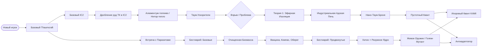

# GDD | Часть 1: Лор и Структура Прогрессии
## Интеграция: Thaumcraft 4 + IC2 + Scape and Run Parasites

---

## 1. Базовый Лор

### Происхождение Паразитов
Паразиты — не местные существа. Это внеземная форма жизни, вторгшаяся через межпространственные разломы (порталы) из глубокого космоса. Их биология абсолютно чужда концепции «Вис» и магии этого мира.

### Магия и Паразиты
- Аура и Вис нестабильны вблизи скоплений паразитов — их природа разрушает магическое поле.
- Обычный Таумометр не может «прочитать» паразита. Получить данные о нём можно только эмпирически — убивая и изучая.

### Конфликт Искажения и Паразитов
Искажение (Taint) — это не болезнь, это иммунный ответ реальности. Оно рассматривает паразитов как инородный микроорганизм.
- Мобы Искажения (щупальца, рои) при обнаружении паразитов автоматически атакуют их.
- Блоки заражения (SRP) не могут конвертировать биомы Искажения, и наоборот — вечное сопротивление на границе биомов.
- Атаки с аспектом `Vitium` наносят паразитам повышенный урон и игнорируют их адаптацию.

---

## 2. Структура Вкладок Таумономикона

Мы добавляем **три новые вкладки**:

| Вкладка | Содержание | Иконка |
|---|---|---|
| **Внеземная Биология** (SRP) | Только теория, лор и записи Бестиария. Практические рецепты открываются в других вкладках | Паразит |
| **Индустриальная Магия** (IC2) | Таумо-физика, конвертеры, ускорители, мультиблоки | Шестерня |
| **Синтез** (Эндгейм) | Гибридные сплавы, броня KAMI + IC2, Антиадаптатор | Звезда Ихора |

---

## 3. Механика: Полевой Бестиарий (SRP)

Таумометр **не работает** на паразитах напрямую. Прогрессия в ветке SRP идёт через полевой опыт.

**Шаг 1 — Счётчик Убийств:**
Убив 15–20 особей одного вида (например, `Buglin`, `Rupter`, `Leaper`), вы получаете событие «Прорыв в изучении вида». В инвентарь падает **Страница Полевого Дневника**.

**Шаг 2 — Кластеры знаний:**
Страницы группируются в кластеры. Пример:
- 3 страницы Базовых форм → разблокируется **Магическая Вакцина** (в Алхимии)
- 3 страницы Продвинутых форм → разблокируется **Живое Оружие** (в Тауматургии)
- 2 страницы Боссов → разблокируется **Антиадаптатор** (в Синтезе)

**Шаг 3 — Вкладка «Паразитология»:**
Каждая страница добавляет статью в Бестиарий: слабости, поведение, происхождение. Никаких рецептов — только лор.

---

## 4. Механика: Таумо-Физические Проблемы (IC2)

Магия и электричество вместе — нестабильны. Прогресс в ветке IC2 требует **решения технических задач**.

**Структура:**
- Каждый Таум-Ускоритель увеличивает «нагрузку» сети.
- При превышении лимита — выброс Флюкса + взрыв блока ускорителя.
- Чтобы поднять лимит, нужно исследовать **Таумо-Физические Теории** в Таумономиконе.

**Список Теорий (по порядку):**
1. **«Эфирная Изоляция»** — увеличивает предел сети ×2. Крафт изоляторов из Таум-стекла.
2. **«Резонанс Переменного Тока Вис»** — КПД ускорителей +25%. Требует Вис-Кристаллы.
3. **«Квантовое Туннелирование Эссенции»** — ускорители могут работать через 1 блок расстояния. Требует Квантовые схемы IC2.

---

## 5. Диаграмма: Общий Поток Прогрессии

---

*Следующие части: [Часть 2 — IC2 Предметы и Крафты](ic2_srp_design_part2_ic2.md), [Часть 3 — SRP Предметы и Крафты](ic2_srp_design_part3_srp.md), [Часть 4 — Эндгейм](ic2_srp_design_part4_endgame.md)*
