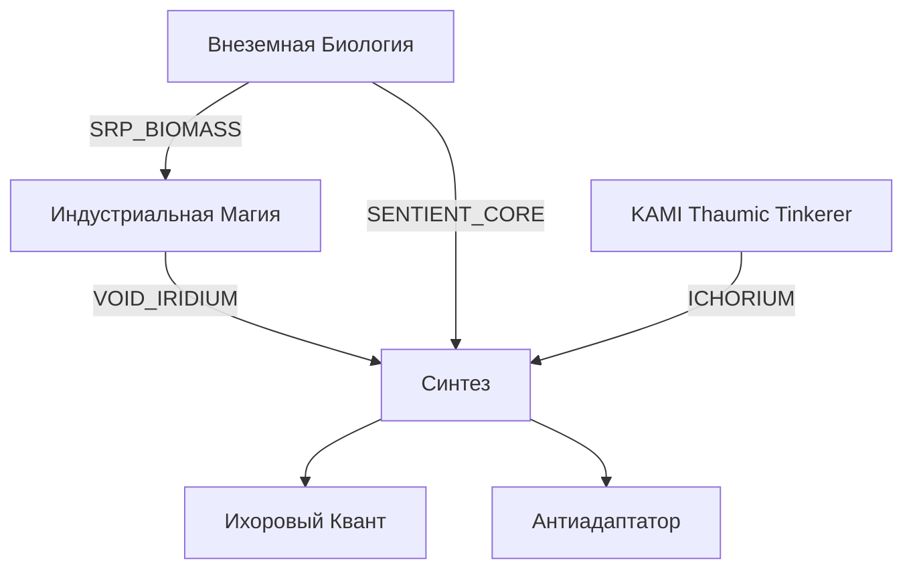

# Research Tree: IC2 + SRP Integration
## Только названия и связи. Без крафтов и свойств.

---

## Вкладка 1: Индустриальная Магия (IC2)

```
THAUM_IC2_INTRO                          ← корень вкладки, открывается при первом контакте с EU
  └── THAUM_ORE_MACERATION               ← дробление руд ТК в IC2
  └── ALUMENTUM_FUEL                     ← алюментум как топливо IC2
  └── NITOR_HEAT                         ← нитор как источник тепла
  └── THAUM_STEEL                        ← слиток таум-стали
        └── ELECTRIC_SCRIBING            ← электрическая чернильница
        └── THAUM_CARBON_MESH            ← таум-углеродная ткань
              └── VIS_CRYSTAL            ← вис-кристалл
  └── VIS_TO_EU_GENERATOR                ← таум-генератор (вис → eu)
  └── EU_TO_VIS_ENGINE                   ← эфирный двигатель (eu → вис)
        └── THAUMIC_OVERCLOCKER          ← таум-ускоритель механизмов
              └── THEORY_ETHER_ISOLATION ← теория: эфирная изоляция (решение перегрузки)
                    └── THEORY_AC_VIS_RESONANCE   ← теория: резонанс переменного тока вис
                          └── THEORY_QUANTUM_TUNNEL ← теория: квантовое туннелирование эссенции
                    └── INFERNAL_FURNACE_5x5       ← индустриальная адская печь
  └── WAND_ROD_STEEL                     ← стальные наконечники жезла
  └── WAND_ROD_CARBON                    ← углеволоконный стержень
  └── WAND_ROD_QUANTUM                   ← квантовые наконечники (нужен VIS_CRYSTAL)
  └── FOCUS_TESLA                        ← набалдашник: плазма
  └── FOCUS_PURIFICATION                 ← набалдашник: очищение (нужен SRP_BIOMASS)
  └── GOLEM_DRILL_KIT                    ← аксессуары голема: бур + бат-пак
  └── GOLEM_NANO_SHIELD                  ← аксессуар голема: нано-щит
```

---

## Вкладка 2: Внеземная Биология (SRP)
### (Эта вкладка — только лор. Практические рецепты открываются в других вкладках.)

```
SRP_INTRO                                ← корень, открывается при первой встрече с паразитом
  └── SRP_BESTIARY_BASIC                 ← бестиарий: базовые (15–20 убийств базовых форм)
        └── SRP_BESTIARY_ADVANCED        ← бестиарий: продвинутые (убийства адаптированных форм)
              └── SRP_BESTIARY_ELITE     ← бестиарий: элита (боссы/скопления)
```

### Практические исследования, разблокируемые через Бестиарий:

**Алхимия:**
```
SRP_BESTIARY_BASIC  →  ALCHEMY_VACCINE              ← магическая вакцина/прививка
                    →  ALCHEMY_INFECTION_ROLLBACK    ← откат заражения мобов
```

**Изобретения:**
```
SRP_BESTIARY_BASIC    →  INVENTION_COMPASS           ← рунная компас-сфера
SRP_BESTIARY_ADVANCED →  INVENTION_WARD_OF_PURITY    ← оберег от инфекции
SRP_BESTIARY_ADVANCED →  INVENTION_LIVING_TOOLS      ← живые инструменты
```

**Тауматургия:**
```
SRP_BESTIARY_ADVANCED →  THAUMATURGY_PURIFIED_BIOMASS ← очищенная биомасса
                          └── THAUMATURGY_ELDRITCH_CHITIN  ← жуткий хитин
                                └── THAUMATURGY_SENTIENT_CORE  ← разумное ядро
                                      └── THAUMATURGY_VOID_LIVING_BLADE  ← живое оружие пустоты
                                      └── THAUMATURGY_FLESH_GOLEM        ← голем-мутант
SRP_BESTIARY_ELITE    →  THAUMATURGY_ANTI_ADAPT_BATTERY ← антиадаптатор (эндгейм)
```

---

## Вкладка 3: Синтез (Эндгейм)
### Открывается только при наличии прогресса в обеих предыдущих вкладках.

```
SYNTHESIS_INTRO                                   ← корень, открывается при крафте Пустотного Иридия
  └── VOID_IRIDIUM                                ← пустотный иридий
        └── VIS_EU_SINGULATOR                     ← сингулятор вис-eu (баблс)
        └── ARMOR_NANO_THAUM                      ← нано-таум броня (нужен VIS_CRYSTAL + THAUM_CARBON_MESH)
              └── ARMOR_VOID_QUANTUM              ← пустотный квант (нужен VOID_IRIDIUM)
                    └── ARMOR_ICHOR_QUANTUM       ← ихоровый квант (нужен KAMI: ICHORIUM)
  └── ANTI_ADAPT_BATTERY                          ← пустотно-биологическая батарея
                                                     (нужен VIS_EU_SINGULATOR + THAUMATURGY_SENTIENT_CORE)
```

---

## Общая Схема Связей Между Вкладками


