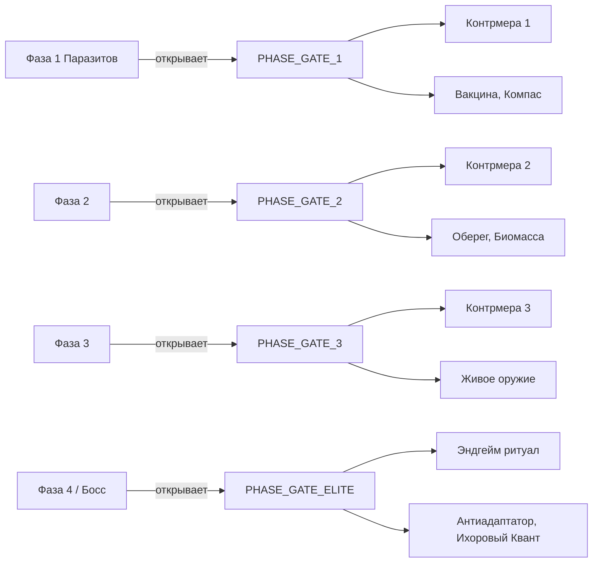

# Research Tree v2: IC2 + SRP Integration
## Только названия и связи. [ЛОРНОЕ] = не даёт рецепт, только объясняет механику.

---

## Вкладка 1: Индустриальная Магия (IC2)

```
THAUM_IC2_INTRO                              ← корень; открывается при первом контакте с EU
│
├── [ЛОРНОЕ] LORE_EU_AND_VIS                 ← «EU и Вис: два языка одной энергии»
│                                               Объясняет почему они несовместимы напрямую
│
├── [ЛОРНОЕ] LORE_ELAN_VITAL                 ← «Эфирная жизненная сила»
│                                               Почему магия дестабилизирует электросхемы
│
├── THAUM_ORE_MACERATION                     ← дробление руд ТК в IC2
│
├── ALUMENTUM_CANNON_AMMO                    ← алюментум как снаряд для IC2-пушки
│   │                                           (не топливо — взрывной снаряд Gauss/Rail)
│   └── IC2_THAUM_CANNON                     ← сама пушка (новый блок или апгрейд Rail Gun)
│
├── NITOR_HEAT                               ← нитор как вечное тепло
│   └── NITOR_THERMAL_GENERATOR              ← нитор-термальный генератор (тепло → EU)
│       └── INFERNAL_FURNACE_5x5             ← индустриальная адская печь (нужен генератор)
│
├── THAUM_STEEL                              ← слиток таум-стали
│   ├── ELECTRIC_SCRIBING                    ← электрическая чернильница
│   └── THAUM_CARBON_MESH                    ← таум-углеродная ткань
│       └── VIS_CRYSTAL                      ← вис-кристалл
│
├── VIS_TO_EU_GENERATOR                      ← таум-генератор (вис → eu)
│   │
│   └── [ЛОРНОЕ] LORE_RESONANCE_LIMITS       ← «Пределы резонанса»
│                                               Объясняет почему нельзя ставить генераторы рядом
│
├── EU_TO_VIS_ENGINE                         ← эфирный двигатель (eu → вис)
│   └── THAUMIC_OVERCLOCKER                  ← таум-ускоритель механизмов
│       │
│       ├── [ЛОРНОЕ] LORE_OVERLOAD_THEORY    ← «Теория перегрузки сети»
│       │                                       Объясняет механику взрыва при превышении лимита
│       │
│       └── THEORY_ETHER_ISOLATION           ← теория: эфирная изоляция (решение перегрузки)
│           ├── THEORY_AC_VIS_RESONANCE      ← теория: резонанс переменного тока вис
│           │   └── THEORY_QUANTUM_TUNNEL    ← теория: квантовое туннелирование эссенции
│           └── (открывает INFERNAL_FURNACE_5x5 в ветке нитора)
│
├── WAND_ROD_STEEL                           ← стальные наконечники жезла
├── WAND_ROD_CARBON                          ← углеволоконный стержень
├── WAND_ROD_QUANTUM                         ← квантовые наконечники (нужен VIS_CRYSTAL)
├── FOCUS_TESLA                              ← набалдашник: плазма
├── FOCUS_PURIFICATION                       ← набалдашник: очищение (нужен SRP_BIOMASS)
├── GOLEM_DRILL_KIT                          ← аксессуары голема: бур + бат-пак
└── GOLEM_NANO_SHIELD                        ← аксессуар голема: нано-щит
```

---

## Вкладка 2: Внеземная Биология (SRP)
### Только лор + Бестиарий. Рецепты — в других вкладках.

### Корень и Лорные исследования
```
SRP_INTRO                                    ← корень; открывается при первой встрече с паразитом
│
├── [ЛОРНОЕ] LORE_PARASITE_ORIGIN            ← «Внезвёздные гости»
│                                               Лор: портал/космос, почему магия им чужда
│
├── [ЛОРНОЕ] LORE_TAINT_RESISTANCE           ← «Сопротивление Искажения»
│                                               Объясняет механику конфликта SRP-биомов и Taint
│
└── [ЛОРНОЕ] LORE_PHASE_MECHANICS            ← «Фазы вторжения»
                                                Объясняет систему очков/фаз паразитов в мире
```

### Бестиарий (по типам, не по каждому мобу)
```
SRP_INTRO
  └── SRP_BESTIARY_TYPE_INFECTED_ANIMALS     ← Тип: Заражённые животные
  │                                             (корова, свинья, волк — один тип)
  │
  └── SRP_BESTIARY_TYPE_INFECTED_VILLAGERS   ← Тип: Заражённые жители
  │
  └── SRP_BESTIARY_TYPE_BASIC_PARASITES      ← Тип: Базовые паразиты
  │     (Buglin, Leaper, Rupter)
  │     └── SRP_BESTIARY_BASIC              ← сводная запись: все базовые изучены
  │
  └── SRP_BESTIARY_TYPE_ADAPTED_PARASITES    ← Тип: Адаптированные формы
  │     (формы с иммунитетами, брони)
  │     └── SRP_BESTIARY_ADVANCED           ← сводная: все адаптированные изучены
  │
  └── SRP_BESTIARY_TYPE_ELITE               ← Тип: Элита и Боссы
        └── SRP_BESTIARY_ELITE             ← сводная: все элиты изучены
```

### Стопперы (gates по фазам паразитов)
Эти исследования **требуют** определённый уровень фазы паразитов в мире чтобы открыться.
Логика: хочешь эндгейм — позволь паразитам вырасти, а потом дай отпор.
```
PHASE_GATE_1 [требует: фаза ≥ 1]            ← открывает ALCHEMY_VACCINE, INVENTION_COMPASS
PHASE_GATE_2 [требует: фаза ≥ 2]            ← открывает INVENTION_WARD_OF_PURITY,
│                                               THAUMATURGY_PURIFIED_BIOMASS
│
├── PHASE_COUNTER_2                          ← контрмера: новое изобретение/ритуал
│                                               для снижения фазы (−очки паразитов)
│
PHASE_GATE_3 [требует: фаза ≥ 3]            ← открывает THAUMATURGY_SENTIENT_CORE,
│                                               THAUMATURGY_VOID_LIVING_BLADE
│
├── PHASE_COUNTER_3                          ← контрмера: ритуал Чистоты
│                                               (масштабная очистка зоны)
│
PHASE_GATE_ELITE [требует: фаза ≥ 4 / Босс] ← открывает ANTI_ADAPT_BATTERY,
                                                ARMOR_ICHOR_QUANTUM
    └── PHASE_COUNTER_ELITE                  ← контрмера: эндгейм-ритуал уничтожения
                                                ульев/маяков
```

### Практические исследования (разблокируются через Бестиарий + Стопперы)

**Алхимия:**
```
SRP_BESTIARY_BASIC + PHASE_GATE_1  →  ALCHEMY_VACCINE
SRP_BESTIARY_BASIC + PHASE_GATE_1  →  ALCHEMY_INFECTION_ROLLBACK
```

**Изобретения:**
```
SRP_BESTIARY_BASIC + PHASE_GATE_1    →  INVENTION_COMPASS
SRP_BESTIARY_ADVANCED + PHASE_GATE_2 →  INVENTION_WARD_OF_PURITY
SRP_BESTIARY_ADVANCED + PHASE_GATE_2 →  INVENTION_LIVING_TOOLS
```

**Тауматургия:**
```
SRP_BESTIARY_ADVANCED + PHASE_GATE_2 →  THAUMATURGY_PURIFIED_BIOMASS
                                          └── THAUMATURGY_ELDRITCH_CHITIN
                                                └── THAUMATURGY_SENTIENT_CORE (PHASE_GATE_3)
                                                      ├── THAUMATURGY_VOID_LIVING_BLADE
                                                      └── THAUMATURGY_FLESH_GOLEM
SRP_BESTIARY_ELITE + PHASE_GATE_ELITE →  THAUMATURGY_ANTI_ADAPT_BATTERY
```

---

## Вкладка 3: Синтез (Эндгейм)

```
SYNTHESIS_INTRO  [открывается: VOID_IRIDIUM crafted]
│
├── [ЛОРНОЕ] LORE_SYNTHESIS_THEORY           ← «Слияние технологий»
│                                               Объясняет почему IC2 + TC + SRP = больше суммы
│
├── VOID_IRIDIUM
│   ├── VIS_EU_SINGULATOR
│   ├── ARMOR_NANO_THAUM
│   │   └── ARMOR_VOID_QUANTUM
│   │       └── ARMOR_ICHOR_QUANTUM [требует KAMI: ICHORIUM + PHASE_GATE_ELITE]
│   └── ANTI_ADAPT_BATTERY [требует VIS_EU_SINGULATOR + THAUMATURGY_SENTIENT_CORE]
```

---

## Общая схема стопперов


