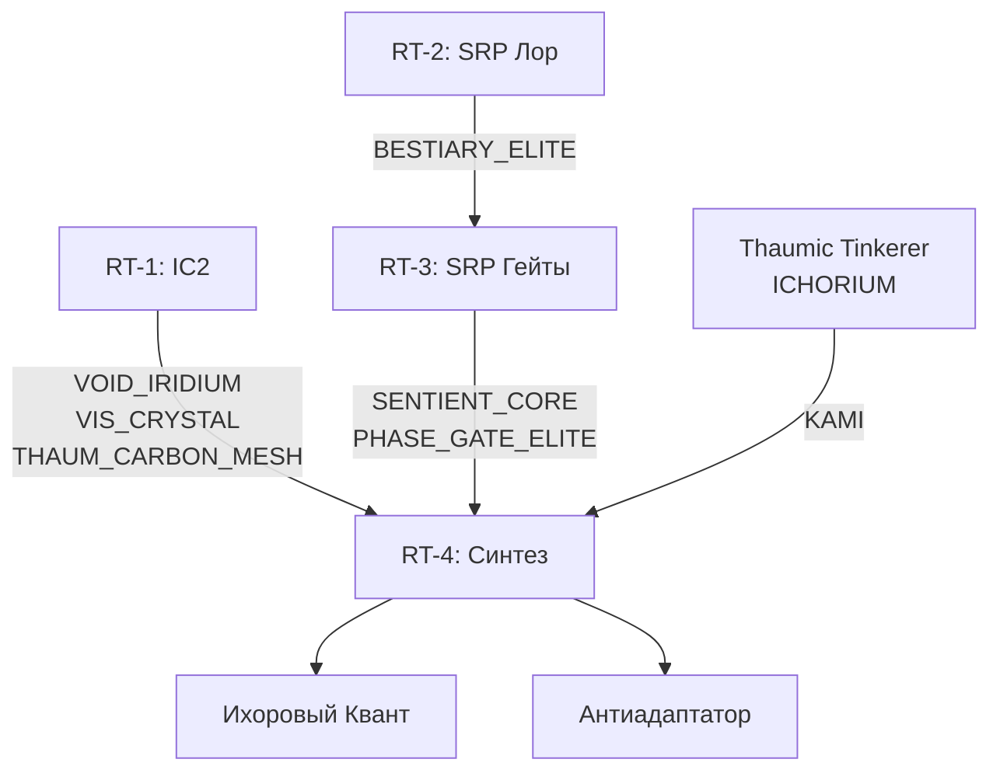

# RT-4: Вкладка «Синтез» (Эндгейм)
## Слияние IC2 + SRP + KAMI. Открывается только при прогрессе в обеих ветках.

---

## Условие открытия вкладки

Вкладка «Синтез» становится видимой игроку только когда выполнены **оба** условия:
- Скрафтил хотя бы один `VOID_IRIDIUM` (Пустотный Иридий)
- Открыт хотя бы `PHASE_GATE_2` (Внеземная Биология)

---

## Дерево Синтеза

```
SYNTHESIS_INTRO                              ← корень вкладки
│
├── [ЛОРНОЕ] LORE_SYNTHESIS_THEORY
│       «Слияние технологий»
│       Объясняет почему IC2 + TC + SRP вместе дают больше суммы частей.
│       Лор: пустотный металл как «клей» между мирами технологии и магии.
│
├── VOID_IRIDIUM                             ← Пустотный Иридий (Иридий IC2 + Пустотный металл)
│   │
│   ├── VIS_EU_SINGULATOR                    ← Сингулятор Вис-EU (баблс)
│   │       Конвертирует EU → Вис для жезла автоматически
│   │       Требует: VIS_CRYSTAL (из RT-1)
│   │
│   ├── ARMOR_NANO_THAUM                     ← Нано-Таум Броня (4 элемента)
│   │       Требует: VIS_CRYSTAL + THAUM_CARBON_MESH (из RT-1)
│   │   └── ARMOR_VOID_QUANTUM               ← Пустотный Квант (4 элемента)
│   │           Требует: VOID_IRIDIUM
│   │           Эффект: лечение за EU, анти-паразит, Искажение +1
│   │       └── ARMOR_ICHOR_QUANTUM          ← Ихоровый Квант (4 элемента) [ФИНАЛ]
│   │               Требует: ARMOR_VOID_QUANTUM + KAMI:ICHORIUM + PHASE_GATE_ELITE
│   │               Эффект: полёт, полный иммунитет ко всему
│   │
│   └── ANTI_ADAPT_BATTERY                   ← Пустотно-Биологическая Батарея [ФИНАЛ]
│           Требует: VIS_EU_SINGULATOR + THAUMATURGY_SENTIENT_CORE + PHASE_GATE_ELITE
│           Эффект:
│           - EU → любой аспект по выбору
│           - Поле 12 блоков: отключает адаптацию паразитов к урону
│           - Медленно разрушает блоки заражения SRP в радиусе 5 блоков
│
└── [ЛОРНОЕ] LORE_ICHOR_IC2_BRIDGE
        «Ихор и Квант»
        Объясняет почему Ихор совместим с квантовой бронёй IC2.
        Открывается автоматически при крафте ARMOR_VOID_QUANTUM.
```

---

## Схема зависимостей между вкладками



---

## Сводная таблица финальных предметов

| Предмет | Требует из RT-1 | Требует из RT-2/3 | Требует KAMI |
|---|---|---|---|
| Нано-Таум Броня | VIS_CRYSTAL, THAUM_CARBON_MESH | — | — |
| Пустотный Квант | VOID_IRIDIUM | — | — |
| Сингулятор | VIS_CRYSTAL | — | — |
| Антиадаптатор | VIS_EU_SINGULATOR | SENTIENT_CORE, PHASE_GATE_ELITE | — |
| Ихоровый Квант | ARMOR_VOID_QUANTUM | PHASE_GATE_ELITE | ICHORIUM |

---
*Индекс: [rt_index.md](rt_index.md) | Предыдущий: [rt_3_srp_gates.md](rt_3_srp_gates.md)*
